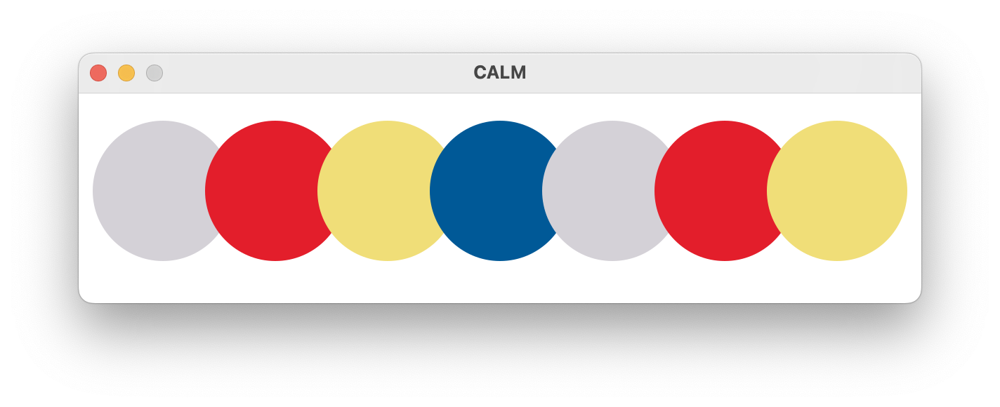

#  Canvas And Lisp Magic

[](#hello-world)

Calm down and draw something, in Lisp.

[](#installation) [](https://github.com/VitoVan/calm/actions/workflows/calm.yml)

## Hello World

Find whatever directory, create a file: **canvas.lisp**

```lisp
(in-package #:calm)
(defparameter *color-list* '((0.83 0.82 0.84) (0.89 0.12 0.17) (0.94 0.87 0.47) (0 0.35 0.59)))
(defun draw ()
  (dotimes (i 7)
    (apply #'c:set-source-rgb (nth (if (>= i 4) (- i 4) i) *color-list*))
    (c:arc (+ 60 (* (- (/ *calm-width* 5) 40) i)) 70 50 0 (* 2 pi))
    (c:fill-path)))
```

Launch your terminal, cd to that directory, enter the command:

```bash
calm
```

## More Examples

<p align="center">
    <a title="Check the code for Fan" href="https://github.com/calm2d/fan"></a>
    <a title="Check the code for Mondrian" href="https://github.com/calm2d/mondrian"></a>
    <a title="Check the code for Meditator" href="https://github.com/calm2d/meditator"></a>
</p>

## Installation

### Pre-built Binary

1. Download the [latest release](https://github.com/VitoVan/calm/releases/latest) for your platform
2. Extract the content
3. Add the extracted folder into your PATH environment

    for macOS, add `/path/to/Calm.app/Contents/MacOS/` instead

### Build Your Own

All the binaries are built with [Github Action](them), so the supported environments are limited.

If you are using something not supported (Apple M1 or ARM Windows / Linux), please consider building your own CALM.

You may need to [build your own SBCL](.github/workflows/sbcl.yml) and modify the [sbcl.sh](sh/fedora/sbcl.sh) before executing the following command.

```bash
git clone https://github.com/VitoVan/calm.git
cd calm
# on macOS or Linux
sh build/build.sh
# on Windows (you should have MSVC compiler installed)
build\\build.bat
```


##  Distribution

Distribute your CALM Application.

### Standard Distribution

To distribute your applications to non-wizard users, to provide a portable application package for those who fears the dark of the terminal.

Launch your terminal, cd to the directory where the file **canvas.lisp** exists, enter the command:

```bash
calm dist
```

You will get a directory `dist` containing all the dependencies and your final binary, you should put all your assets (.wav, .png, .mp3, etc.) into that directory.

Now, pack it and send it to your friend! Normally, they will be able to enjoy your application. If not, tell them to run the file `calm` or double click `calm.exe`.

> **Note**
>
> for macOS, you may want to create an [application bundle](https://en.wikipedia.org/wiki/Bundle_(macOS)):
>
> <details><summary>Click to show code</summary>
> <p>
>
> ```bash
> export APP_ICON=/path/to/your/app.icns
> export APP_NAME=Hello
> export APP_VERSION=0.0.1
> export DIST_DIR=/path/to/your/dist
> calm sh darwin bundle
> ```
>
> </p>
> </details>


### Canvas Distribution

For those who love the source, for the maximum configurability.

```bash
calm dist-with-canvas
```

Mostly identical to the standard distribution, but with `canvas.lisp` included.

This gives the end user ability to modify your application.

It is very convenient when your friend has a bad taste in color.

### Expedient Distribution

Your friend is using Linux / macOS / Windows, but you don't have the corresponding OS.

Let's say it's Windows.

You could also distribute expediently:

1. download [the latest](https://github.com/VitoVan/calm/releases/latest) `hello-canvas.zip `
2. extract it
3. replace the `canvas.lisp` file with yours
4. zip it and send it to your friend

> **Note**
> 1. Don't use Quicklisp, normally it won't work.
> 2. CFFI might work, but foreign libraries (except SDL2, Cairo, etc.) are not guaranteed to exist.

## Environment Variables

Setf-able:

- `SDL_VIDEO_ALLOW_SCREENSAVER=1`

  Allow screensaver, check [Why does SDL disable my screensaver by default?](https://wiki.libsdl.org/SDL2/FAQUsingSDL#why_does_sdl_disable_my_screensaver_by_default)

- `CALM_EVAL='(format t "hello")'`

  Some lisp code eval-ed after loading your `canvas.lisp` and before start

Read-only:

- `CALM_DIR`

  This variable holds the path of the directory where calm binary exists

- `APP_DIR`

  This variable holds the path of the directory where calm was started up (aka `pwd`)
