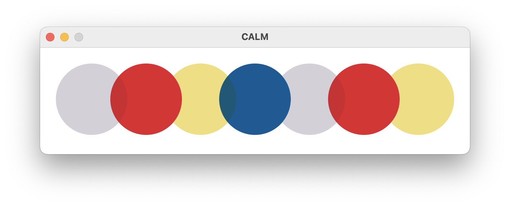
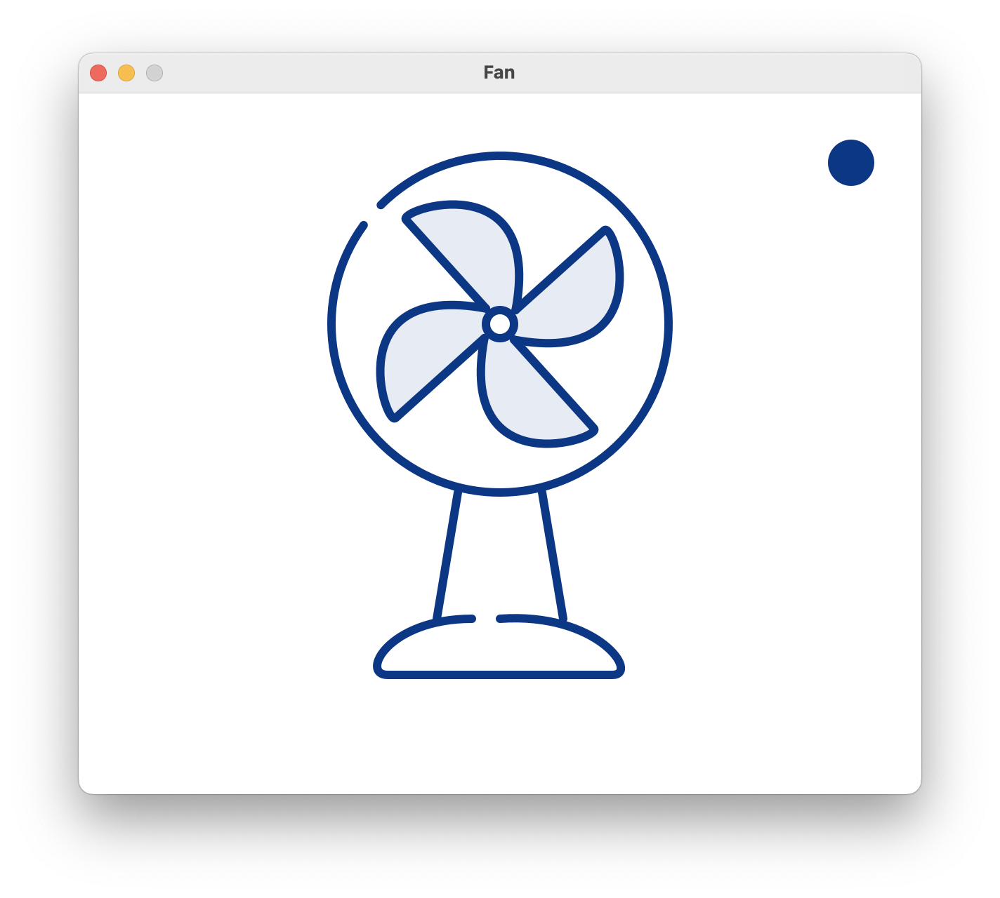
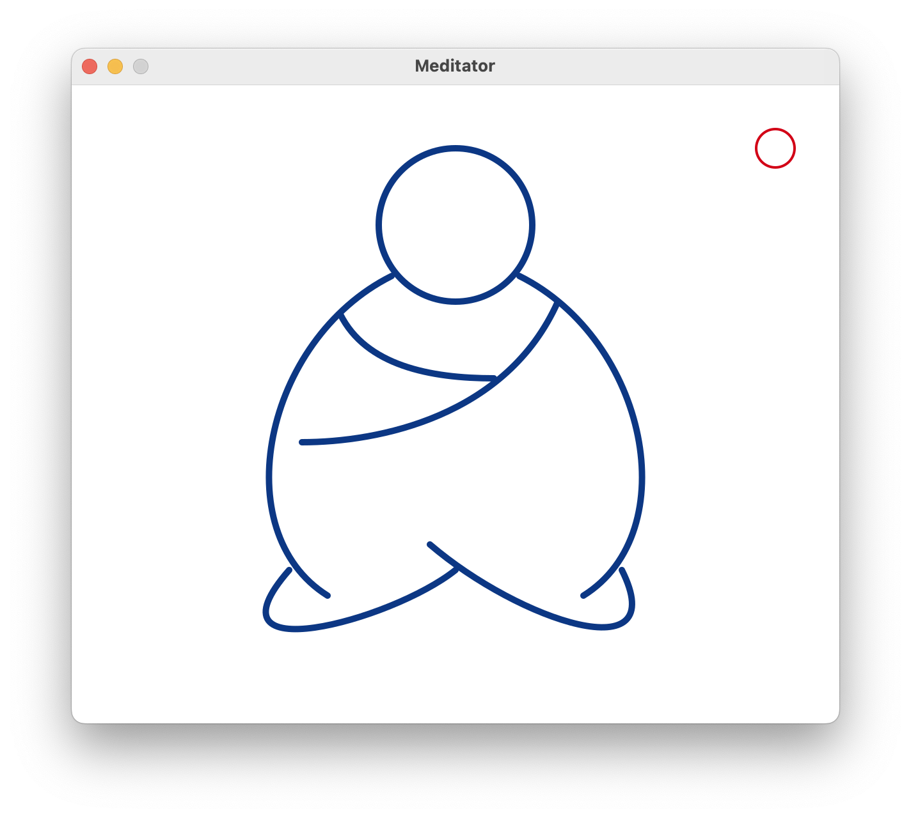
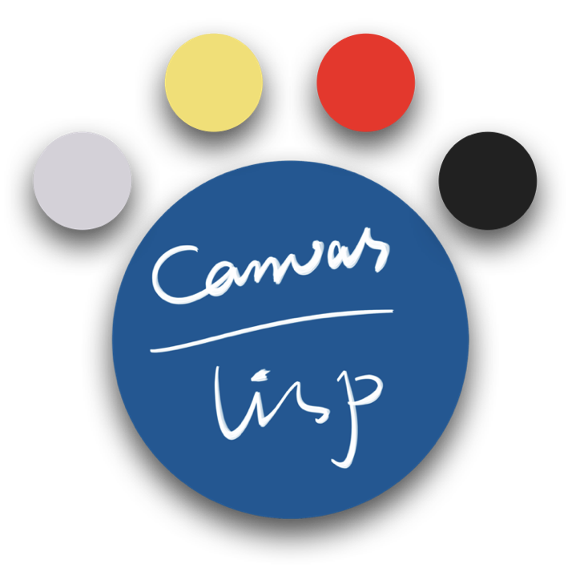
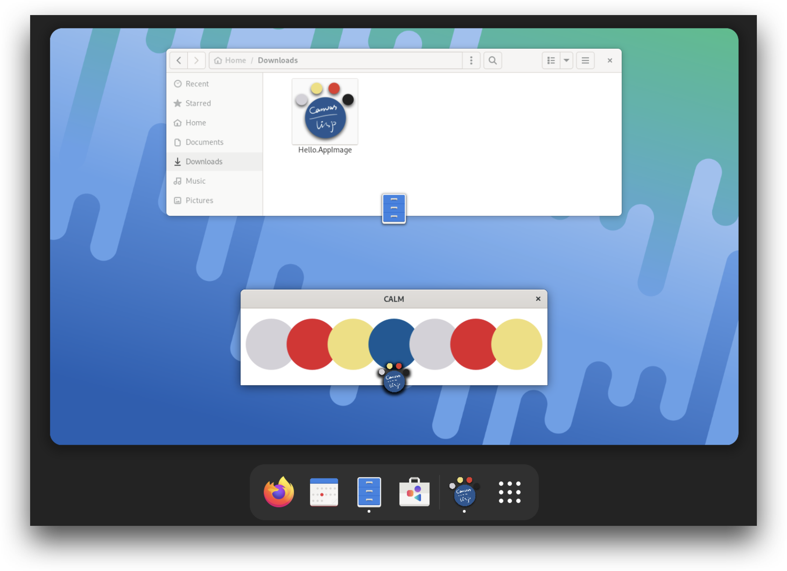
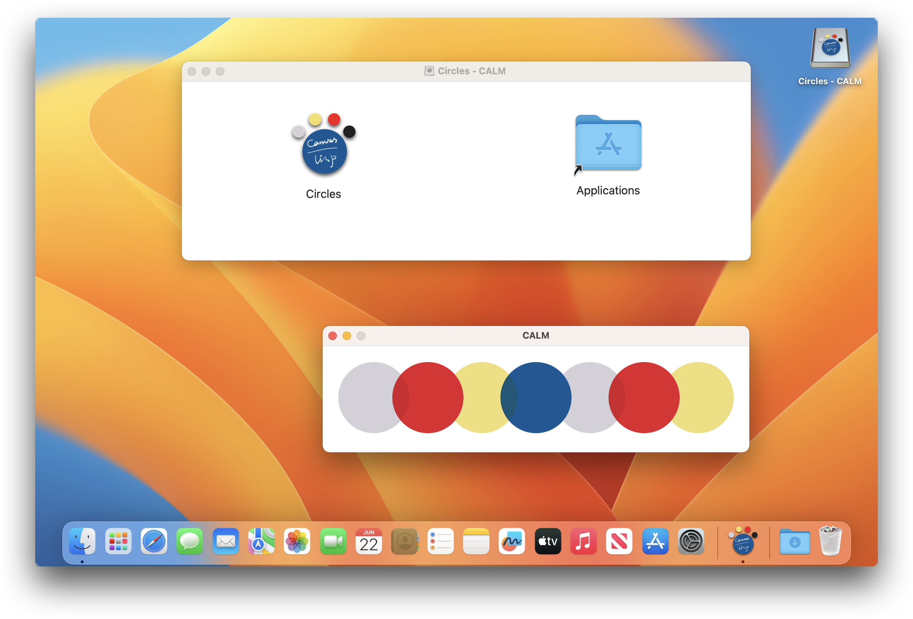
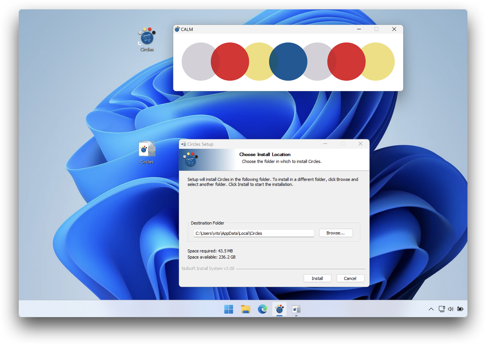

#  C A L M

[](https://github.com/VitoVan/calm/actions/workflows/calm.yml) [](#pre-built-binary) [](https://discord.gg/xN6VeaMr2a)

**C**anvas **A**ided **L**isp **M**agic: Create canvas-based applications with Lisp and distribute them on Linux, macOS, Windows, and the web.

English | [日本語](README_JA.md)

## Hello, World!

Find whatever directory, and create a file: **canvas.lisp**

```lisp
(defparameter *color-list* '((0.83 0.82 0.84) (0.89 0.12 0.17) (0.94 0.87 0.47) (0 0.35 0.59)))
(defun draw ()
  (c:set-operator :darken)
  (dotimes (i 7)
    (c:arc (+ 72 (* (- (/ *calm-window-width* 5) 44) i)) 73 50 0 (* 2 pi))
    (apply #'c:set-source-rgb (nth (if (>= i 4) (- i 4) i) *color-list*))
    (c:fill-path)))
```

Launch your terminal, cd to that directory, and enter the command:

```bash
calm
```

[](#hello-world)

## Examples

<p align="center">
    <a href="https://vitovan.com/calm/1.3.1/fan/calm.html"></a>
    <a href="https://vitovan.com/calm/1.3.1/mondrian/calm.html"></a>
    <a href="https://vitovan.com/calm/1.3.1/meditator/calm.html"></a>
</p>

Source files and binaries for the above examples are [here](https://github.com/VitoVan/calm/tree/main/docs/examples) and [here](https://github.com/VitoVan/calm/releases/tag/1.3.1).

For more applications made with CALM, please check [Made with CALM](https://github.com/VitoVan/made-with-calm).

##  Installation

### Pre-built Binary

1. Downloads

   [](<https://github.com/VitoVan/calm/releases/latest/download/calm.tgz>)
   [](<https://github.com/VitoVan/calm/releases/latest/download/calm.macos-14.dmg>)
   [](<https://github.com/VitoVan/calm/releases/latest/download/calm.zip>)
   [](<https://github.com/VitoVan/calm/releases/latest/download/calm.macos-13.dmg>)
   [](<https://github.com/VitoVan/calm/releases/latest/download/calm.macos-12.dmg>)

2. Extract

3. Add the extracted directory into your PATH environment

   for macOS, add `/path/to/Calm.app/Contents/MacOS/` instead

For macOS and Windows users, you need to be smarter than [Windows SmartScreen](https://duckduckgo.com/?q=how+to+bypass+smartscreen) or able to [tame macOS](https://support.apple.com/guide/mac-help/open-a-mac-app-from-an-unidentified-developer-mh40616/mac) to use CALM. In case anything went wrong, here is an [Installation Guide](docs/installation.md).

### Run from Source

Supported platforms are currently limited by [Github Actions runner images](https://github.com/actions/runner-images).

If your platforms are not supported, feel free to [Run from Source](docs/hacking.md#run-from-source).

##  Distribution

Launch your terminal, cd to the directory where the file **canvas.lisp** exists, enter the command:

```bash
calm publish
```

This command will generate different packages on different platforms:

**Linux: AppImage**



>  **Note**
>
>  The fancy window icon doesn't show on Wayland, I don't know why.

**macOS: Application Bundle**



>**Note**
>
>DMG creation is powered by [create-dmg](https://github.com/create-dmg/create-dmg) and will be installed by `brew install create-dmg` if it were not present. So if you don't have create-dmg, this will install create-dmg for you.
>
>And, if you don't have [Homebrew](https://brew.sh/), this will also install Homebrew for you.
>
>The binary detection was done by `command -v create-dmg` and `command -v brew`.

**Windows: Installer**



> **Note**
>
> Installer creation is powered by [NSIS](https://nsis.sourceforge.io/) and will be installed by `winget install nsis` if it were not present. So if you don't have NSIS (i.e., `makensis`) under your PATH, this will install NSIS for you.
>
> And, if you don't have [winget](https://github.com/microsoft/winget-cli) under your PATH, this will also install winget for you.
>
> The binary detection was done by `where makensis` and `where winget`.

### To the Web

```bash
calm publish-web
```

This command could compile your Lisp code into web pages that could be served on the internet.

For more, please refer to the [Command Reference](#command-reference).

# CALM - References

From CALM 1.0.0, the version number will follow [Semantic Versioning Specification](https://semver.org/spec/v2.0.0.html). This means you can use CALM calmly without worrying about me being crazy. Because whenever I'm going to be crazy, I will let you know [before anything got changed](https://semver.org/spec/v2.0.0.html#spec-item-7) and bump the major version if [anything could surprise](https://semver.org/spec/v2.0.0.html#spec-item-8) you.

Keep CALM and have fun.

## Command Reference

### `calm`

You should run this command inside your project directory, where the file **canvas.lisp** should exist.

This command will load **canvas.lisp** and show a window according to the instructions of the function  `draw` or `draw-forever`. The file **canvas.lisp** is just a regular Lisp source file, you do whatever you like in it.

For CALM-related functions and parameters, please refer to the [API Reference](#api-reference).

### `calm hello`

This command will create a sample application with the default directory structure. You should create a project directory first, such as:

```bash
mkdir my-cool-app
cd my-cool-app
calm hello
```

You will have the following files and directories created:

```text
.
├── assets
├── canvas.lisp
└── fonts
    └── fonts.conf
```

Files put into **assets** and **fonts** directories will be packed with your application during distribution. If you put your favorite font into the **fonts** directory, you will be able to use it inside your application.

For more about font usage, please refer to the [API Reference: Rendering Text](#rendering-text).

### `calm publish`

This command will generate:

- Linux AppImage
- macOS Application Bundle inside DMG
- Windows Application Installer

according to the platform it was running on.

It does not take any arguments, but some options could be set through the environment variables, please check `calm publish-with-options` for the option details.

### `calm publish-with-options`

This command will do the same thing as `calm publish`, instead it will ask your opinions on all the customizable options (with a default value provided, don't worry), respectively:

| OS | ENV | Description                                                  |
| ---------------- | -------------------- | ------------------------------------------------------------ |
| Linux            | APP_NAME             | The name of the AppImage file                                |
| Linux            | APP_ICON             | Icon of the AppImage file and SDL2 Window, absolute path of a PNG file |
| macOS            | APP_NAME             | The name of the macOS Application bundle, will appear in the Launchpad |
| macOS            | APP_ICON             | macOS Application icon, absolute path of an ICNS file        |
| macOS            | BUNDLE_ID            | [CFBundleIdentifier](https://developer.apple.com/documentation/bundleresources/information_property_list/cfbundleidentifier), such as `com.vitovan.helloworld` |
| macOS            | APP_VERSION          | [CFBundleShortVersionString](https://developer.apple.com/documentation/bundleresources/information_property_list/cfbundleshortversionstring), such as: `10.14.1` |
| macOS            | DMG_ICON             | The icon of the Apple Disk Image (DMG), absolute path of an ICNS file |
| Windows          | APP_NAME             | Windows Application Name, will appear in the *Control Panel > Programs and Features*, *Apps & features* and as the name of desktop shortcut |
| Windows          | APP_ICON             | Windows EXE icon, absolute path of an ICO file               |

If you have provided the corresponding environment variable, the option will not be asked. You could also set these environment variables while using the command `calm publish`, the options will be picked up.

### `calm publish-web`

This command will generate a  **web** directory containing all the necessary materials for you to serve it on the internet. The common usage could be like this:

```bash
cd my-cool-app
calm publish-web
```

You will have the following files created:

```text
web
├── calm.data
├── calm.html
├── calm.js
├── calm.wasm
├── canvas.js
├── favicon.ico
└── jscl.js
```

**calm.html** is the entry point, due to the limitation of the web browser, please view this file through HTTP protocol, such as:

```bash
cd web
python3 -m http.server 8000
```

Then open http://127.0.0.1:8000/calm.html in your browser.

Note: The files inside **fonts** and **assets** directories will *NOT* be packed by default, please check the REBUILD_WASM_P option below.

### `calm publish-web-with-options`

This command works like `calm publish-with-options` except it's for `calm publish-web`.

| ENV | Description                                                  |
| -------------------- | ------------------------------------------------------------ |
| LISP_FILES           | Code like `(load "shape.lisp")` may cause problems for the web application, since JSCL will try to load that file via HTTP requests. <br/>If you need to include the extra files other than **canvas.lisp**, please modify your code to bypass JSCL, for example: `#-jscl (load "shape.lisp")` and then set this option, such as: `("/abs/path/to/canvas.lisp" "/abs/path/to/shape.lisp")`. Please remember to escape the double quotes if you're going to set the ENV. |
| REBUILD_WASM_P       | By default WebAssembly files were not built locally, they were downloaded from the [CALM Releases](https://github.com/VitoVan/calm/releases/): **calm.tar**. This prebuilt WebAssembly binary bundled with [OpenSan-Regular.ttf](https://github.com/googlefonts/opensans/raw/main/fonts/ttf/OpenSans-Regular.ttf) and [exposed all the Cairo and SDL2 APIs](https://github.com/VitoVan/calm/blob/main/s/usr/web/wasm.lisp#L61) mentioned in the below [API Reference](#api-reference) section.<br/> If you need to bundle other **fonts** or **assets**, or you need to expose more C APIs be exposed to the web, please set this option to "yes". <br/>Caution: Building WebAssembly binaries involves a whole lot of dependencies, to simplify this progress, I irresponsibly utilized docker. So, please make sure you have the `docker` command at your disposal.<br/>Default: "no" |

Since JSCL is the backbone of CALM on the web, any change of JSCL will be considered as a change of CALM itself. The code base of JSCL used by each version of CALM is fixed, it won't change unless you update CALM. Please feel safe to use it.

### API Reference

CALM is intended to be a thin layer above [SDL2](https://wiki.libsdl.org/SDL2/FrontPage), [Cairo](https://www.cairographics.org/), and some other things. So the number of APIs provided by CALM is intended to be as small as possible.

#### Fundamentals

##### File `canvas.lisp`

This is the entry file for a CALM application. Typically, it should contain a function called `draw`.

##### Function `draw`

This is the entry function for a CALM application, it will be called once the application started. You are supposed to call some canvas drawing functions to be shown, such as:

```lisp
(defun draw ()
  (c:set-source-rgb 1 0 0)
  (c:arc 200 73 50 0 (* 2 pi))
  (c:fill-path))
```

This function will be called passively. That is to say, this function won't be called again after the first call, unless any event has been triggered by the user, such as mouse motion, key down, key up, mouse button down, etc.

If you want to continually refresh the canvas without user interaction, you should use `draw-forever`.

Note: Functions like `c:arc` are third-party APIs exposed by CALM. Please refer to [Drawing on Canvas](#drawing-on-canvas) for more info.

##### Function `draw-forever`

This function also serves as the entry point for a CALM application, similar to the `draw` function. It is important to avoid defining both `draw` and `draw-forever` as doing so would have severe consequences, comparable to killing John Wick's dog.

This function will be called every `*calm-delay*` milliseconds, regardless of user interaction.

##### Variable `*calm-delay*`

This variable controls how many milliseconds CALM should wait before refreshing the canvas.

Default: 42

This variable only works on the desktop platform, for the web platform, please check `*calm-fps*`.

##### Variable `*calm-redraw*`

This variable controls if the canvas will be refreshed from now on.

Normally, you don't need to touch this variable. But if you are using `draw-forever` and you want to manually control the process of refreshing, it could be useful. Such as:

```lisp
(defparameter *game-started* nil)

(defun on-keyup (key)
  (when (c:keq key :SCANCODE-SPACE)
    (setf *game-started* (not *game-started*))))

(defun draw-forever ()
  (format t "drawing canvas...~%")
  (c:set-source-rgb (/ 12 255) (/ 55 255) (/ 132 255))
  (c:paint)
  (c:set-source-rgb 1 1 1)
  (c:move-to 70 90)
  (c:select-font-family "Arial" :normal :normal)
  (c:set-font-size 60)
  (c:show-text (format nil "Press SPACE: ~A" (write-to-string (mod (c:get-ticks) 9))))
  (setf *calm-redraw* *game-started*))
```

Note: this variable will be set to `T` whenever a user event was triggered.

##### Variable `*calm-fps*`

This variable controls how many milliseconds CALM should wait before refreshing the canvas. Setting 0 will use the browser’s `requestAnimationFrame` mechanism to refresh the canvas.

Default: 42

This variable only works on the web, for the desktop platform, please check `*calm-delay*`.

#### Drawing on Canvas

Drawing in CALM could be achieved via [Cairo](https://www.cairographics.org/).

To know more about how to draw anything, please read [Cairo Tutorial](https://www.cairographics.org/tutorial/) and [Cairo API](https://www.cairographics.org/manual/), most of the code could be modified to work in CALM.

For example:

```c
cairo_set_line_width (cr, 0.1);
cairo_set_source_rgb (cr, 0, 0, 0);
cairo_rectangle (cr, 0.25, 0.25, 0.5, 0.5);
cairo_stroke (cr);
```

is equivalent to

```lisp
(c:set-line-width 0.1)
(c:set-source-rgb 0 0 0)
(c:rectangle 0.25 0.25 0.5 0.5)
(c:stroke)
```

All the symbols [exported by cl-cairo2](https://github.com/rpav/cl-cairo2/blob/master/src/package.lisp#L7-L142) should be accessible through `c:` prefix, such as: `c:arc`. On the web, the accessible symbols are limited by [cairo.lisp](https://github.com/VitoVan/calm/blob/main/src/web/cairo.lisp#L266-L405).

Since Cairo is the cardinal drawing facility of CALM, any change of Cairo-related symbols will be considered as a change of CALM itself. Please feel safe to use them.

##### Function `c:rrectangle`

Draw a rounded rectangle.

```lisp
(defun draw ()
  (c:set-source-rgb 0 0 1)
  (c:rrectangle 20 20 100 100 :radius 8) ;; <---- here
  (c:fill-path))
```

##### Function `c:show-png`

Show a png file.

```lisp
(defun draw ()
  (c:show-png "assets/calm.png" 20 20 100 100))
```

This function will stretch the png if needed.

#### Rendering Text

##### Function `c:select-font-family`

This function will select a font to be used in `c:show-text`.

```lisp
(c:select-font-family "Open Sans" :normal :normal)
```

It takes three arguments: `family`, `slant` and `weight`. For detailed example, please check `c:show-text`.

To use a custom font without installing it, just put it inside the **fonts** directory, relative to the file **canvas.lisp**.

##### Function `c:show-text`

This function will show simple text.

```lisp
(defun draw ()
  (c:move-to 30 100)
  (c:set-font-size 84)
  (c:select-font-family "Open Sans" :italic :bold)
  (c:show-text "DON'T PANIC"))
```

##### Function `c:show-markup`

This function will show [Pango Markup](https://docs.gtk.org/Pango/pango_markup.html).

```lisp
(defun draw ()
  (c:move-to 20 10)
  (c:set-font-size 84)
  (c:show-markup "This is <span fgcolor='#245791' weight='bold' face='Open Sans'>SICK</span>"))
```

Note that the coordinate system between `c:show-markup` and `c:show-text` are slightly different, so you may need to adjust the position a little if you switch between `c:show-markup` and `c:show-text`.

This function is not exposed to the web due to the following reasons:

1. Pango requires multi-threading, which requires extra [HTTP HEADERS](https://web.dev/coop-coep/) to be set
2. Compiling Pango into WebAssembly will increase the time and data for loading
3. Using Pango often involves extra fonts to be bundled, this will cause more data to be loaded

So I don't think this is a good idea to include Pango by default, albeit it is easy to implement.

#### Playing Sound

##### Function `c:play-wav`

Play a wav file.

If `c:play-wav` were called before, and the previous wav file was still playing, the sound will be merged together.

```lisp
(c:play-wav "assets/ouch.ogg" :loops 0 :channel -1)
```

Set `:loops` to -1 means "infinitely" (~65000 times)

Set `:channel` to -1 means play on the first free channel

The maximum number of files playing at the same time is limited to the variable `*calm-audio-numchans*`.

##### Variable `*calm-audio-numchans*`

The maximum number of wav files being played at the same time.

Default: 8

##### Function `c:volume-wav`

Set the volume of `c:play-wav`.

```lisp
(c:volume-wav 128 :channel -1)
```

The value should be between 0 (silence) and 128.

Set `:channel` to -1 means all channels.

##### Function `c:halt-wav`

Stop playing a channel or all of them.

```lisp
(c:halt-wav :channel -1)
```

Set `:channel` to -1 means all channels.

##### Function `c:play-music`

Play a music file, it can play MP3, Ogg, and WAV.

Other types of files might also work, but they are not guaranteed by CALM.

```lisp
(c:play-music "assets/bgm.ogg" :loops 0)
```

If `c:play-music` were called before, and the previous music was still playing, it will be stopped and the latest music will start playing.

##### Function `c:volume-music`

Set the volume of `c:play-music`.

```lisp
(c:volume-music 128)
```

The value should be between 0 (silence) and 128.

##### Function `c:halt-music`

Stop playing music.

##### Function `c:play-audio`

Play an audio file, this function is only available on the web since it utilizes the [HTMLAudioElement](https://developer.mozilla.org/en-US/docs/Web/API/HTMLAudioElement).

```lisp
(c:play-audio "assets/meow.ogg" :loop-audio-p nil :volume 1)
```

`:volume` should be between 0 and 1.

##### Function `c:halt-audio`

Stop playing one specific audio file or all of them.

```lisp
(c:halt-audio "assets/purr.ogg")
```

If call it without any arguments, it stops all the playing audio.


#### Internal States

##### Variable `*calm-state-mouse-x*`

##### Variable `*calm-state-mouse-y*`

##### Variable `*calm-state-mouse-up*`

##### Variable `*calm-state-mouse-down*`

##### Variable `*calm-state-mouse-just-clicked*`

##### Variable `*calm-state-finger-x*`

##### Variable `*calm-state-finger-y*`

##### Variable `*calm-state-finger-just-tapped*`

The above variables hold the state of the mouse and finger (touch device, like the mobile web browser), they are read-only. The consequence of `(setf *calm-state-mouse-x* 20)` is equivalent to drinking bleach.

##### Function `c:get-ticks`

This is just [SDL_GetTicks](https://wiki.libsdl.org/SDL2/SDL_GetTicks).

#### Event Callbacks

These callbacks are functions that you should define. If you defined any of them, they will be called when the corresponding event was triggered.

##### Callback `on-keydown`

##### Callback `on-keyup`

You know what these callbacks do, what you don't know is their should-be arguments. Please check `c:keq` for a detailed example.

##### Function `c:keq`

This function compares the first argument with an infinite number of SDL2 Scancodes, if any of them matched, it will return `T`.

```lisp
(defun on-keyup (key) ;; keyup handler for evil vimers
  (cond
    ((c:keq key :scancode-left :scancode-h)
     (format t "move left~%"))
    ((c:keq key :scancode-right :scancode-l)
     (format t "move right~%"))
    ((c:keq key :scancode-up :scancode-k)
     (format t "move up~%"))
    ((c:keq key :scancode-down :scancode-j)
     (format t "move down~%"))
    (t (format t "I don't know what to do~%"))))
```

SDL2 Scancode: https://wiki.libsdl.org/SDL2/SDL_Scancode

##### Callback `on-mousewheel`

```lisp
(defun on-mousewheel (x y direction)
  ;; your code here
  )
```

##### Callback `on-mousemotion`

```lisp
(defun internal-on-mousemotion (&key x y)
  ;; your code here
  )
```

##### Callback `on-mousebuttonup`

##### Callback `on-mousebuttondown`

```lisp
(defun on-mousebuttonup (&key button x y clicks)
  ;; your code here
  )
(defun on-mousebuttondown (&key button x y clicks)
  ;; your code here
  )
```

##### Callback `on-fingermotion`

```lisp
(defun on-fingermotion (&key x  y dx dy pressure finger-id)
  ;; your code here
  )
```

##### Callback `on-fingerup`

##### Callback `on-fingerdown`

```lisp
(defun on-fingerup (&key x  y dx dy pressure finger-id)
  ;; your code here
  )
(defun on-fingerdown (&key x  y dx dy pressure finger-id)
  ;; your code here
  )
```

##### Callback `on-windowresized`

```lisp
(defun on-windowresized (width height)
  ;; your code here
  )
```

##### Callback `on-windowenter`

##### Callback `on-windowleave`

These two callbacks do not take any arguments, for example:

```lisp
(defun on-windowenter ()
  ;; your code here
  )
```

#### Window Related

##### Variable `*calm-window*`

This variable is readonly, it holds the created instance of [SDL_Window](https://wiki.libsdl.org/SDL2/SDL_Window).

With this variable, one could utilize all kinds of SDL2 window related functions, such as:

```lisp
;; get window position
(sdl2:get-window-position *calm-window*)

;; set window always on top
(sdl2-ffi.functions:sdl-set-window-always-on-top
 *calm-window*
 sdl2-ffi:+true+)
```

##### Variable `*calm-window-x*`

##### Variable `*calm-window-y*`

The initial position (x, y) of your CALM application window.

Default: `:centered`

##### Variable `*calm-window-flags*`

A list of [SDL_WindowFlags](https://wiki.libsdl.org/SDL2/SDL_WindowFlags).

You could set this value like: `(setf *calm-window-flags* '(:shown :allow-highdpi :resizable))`

Default: `'(:shown :allow-highdpi)`

##### Variable `*calm-window-width*`

##### Variable `*calm-window-height*`

##### Variable `*calm-window-title*`

You know what these variables do.

If you don't, [give me 5 bucks](https://github.com/sponsors/VitoVan/) and think harder.

## Tutorials

Ok ok, I will write this, I will write this, just wait a second.

You could check these useful links while waiting:

- SDL2
    - https://wiki.libsdl.org/SDL2
    - https://github.com/lispgames/cl-sdl2
- Cairo
  - https://www.cairographics.org/

  - https://github.com/rpav/cl-cairo2

- Development Tools
    - https://slime.common-lisp.dev/
    - https://lispcookbook.github.io/cl-cookbook/vscode-alive.html
- Common Lisp
  - https://lispcookbook.github.io/cl-cookbook/
  - http://www.lispworks.com/documentation/HyperSpec/Front/
  - https://lisp-lang.org/books/

## License

The [source code](https://github.com/VitoVan/calm) is released under GPL-2.0-only.
