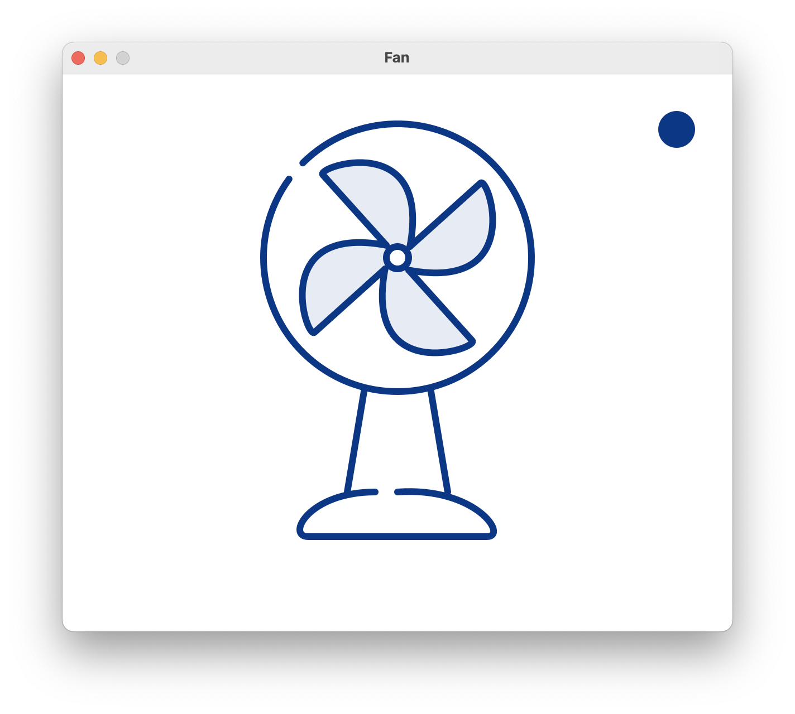
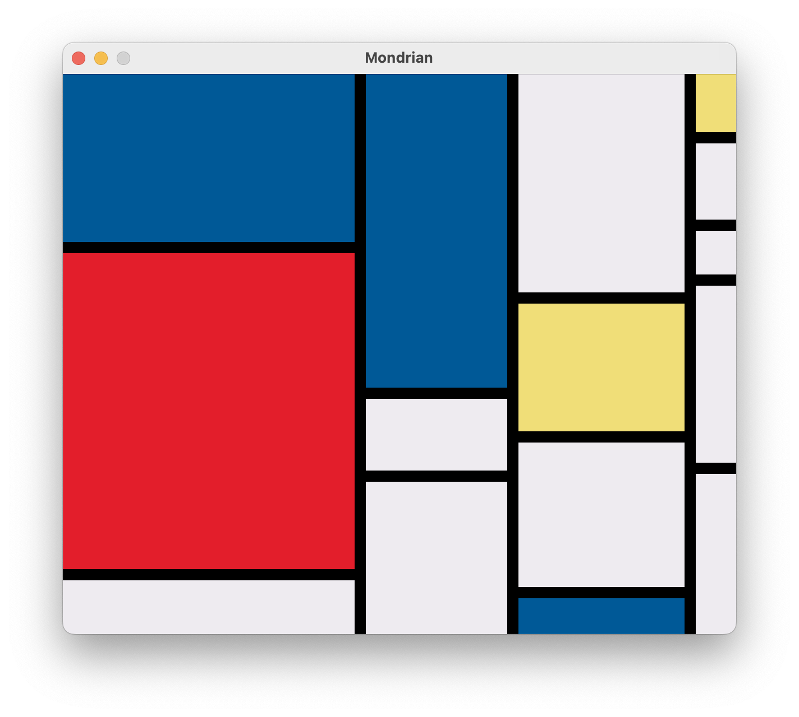

# Canvas And Lisp Magic


Calm down and draw something, in Lisp.

 [](https://github.com/VitoVan/calm/actions/workflows/main.yml)

<p align="center">
    <a title="Check the code for Fan" href="https://github.com/calm2d/fan"></a>
    <a title="Check the code for Mondrian" href="https://github.com/calm2d/mondrian"></a>
    <a title="Check the code for Meditator" href="https://github.com/calm2d/meditator"></a>
</p>

## Installation

### Auto Install

#### *nix (Fedora | Ubuntu | macOS)

```bash
/bin/bash -c "$(curl -fsSL https://raw.githubusercontent.com/VitoVan/calm/main/installer/install.sh)"
```

Paste that in a macOS Terminal or Linux shell prompt.

#### Windows

```powershell
Set-ExecutionPolicy Bypass -Scope Process -Force; [System.Net.ServicePointManager]::SecurityProtocol = [System.Net.ServicePointManager]::SecurityProtocol -bor 3072; iex ((New-Object System.Net.WebClient).DownloadString('https://raw.githubusercontent.com/VitoVan/calm/main/installer/install.ps1'))
```

Paste that in a Windows PowerShell.

### Manual Install

#### 1. Install dependencies

- [SBCL](https://www.sbcl.org)
- [Quicklisp](https://quicklisp.org)
- [SDL2](https://www.libsdl.org)
- [SDL2_mixer](https://www.libsdl.org/projects/mixer)
- [Cairo](https://www.cairographics.org)
- [Git](https://git-scm.com)

For Windows platform, it is only tested under the [MSYS2](https://www.msys2.org) environment.

#### 2. Clone & Setup CALM

```bash
# Clone
git clone https://github.com/VitoVan/calm.git ~/calm
# Config PATH
echo 'export PATH="$PATH:~/calm/"' >> ~/.bash_profile
source ~/.bash_profile
# Build core
calm core
# Start CALM
calm
```

DONE.

## Environment Variables

Setf-able:

- `NO_SWANK=1`

  Disable [Swank](https://www.cliki.net/SWANK), it was enabled by default at port 4242

- `SWANK_PORT=4343`

  Change Swank port to 4343, the default port was 4242

- `NO_CORE=1`

  Disable calm [core](https://www.sbcl.org/manual/#Saving-a-Core-Image), it was enabled by default to reduce the startup time


Read-only:

- `CALM_DIR`

  This variable holds the path of the directory where calm binary locates

- `APP_DIR`

  This variable holds the path of the directory where calm was started up (aka `pwd`)
