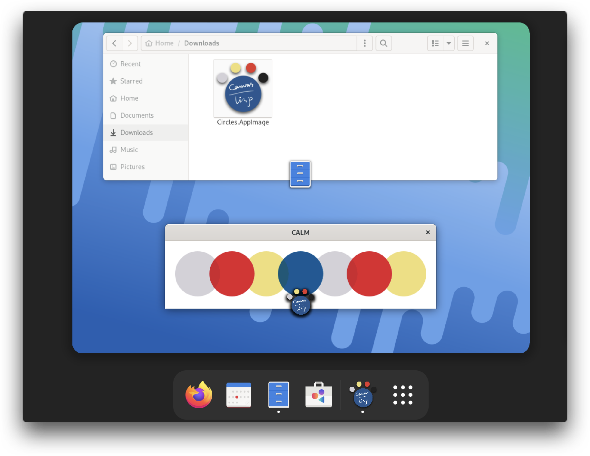

#  Canvas Aided Lisp Magic

[](https://github.com/VitoVan/calm/actions/workflows/calm.yml) [](https://github.com/VitoVan/calm/releases/latest)

A Lisp development environment that enables you to build and distribute canvas based applications as Linux AppImage, macOS Application Bundle, Windows Installer and Web Application.

## Hello World

Find whatever directory, create a file: **canvas.lisp**

```lisp
(defparameter *color-list* '((0.83 0.82 0.84) (0.89 0.12 0.17) (0.94 0.87 0.47) (0 0.35 0.59)))
(defun draw ()
  (c:set-operator :darken)
  (dotimes (i 7)
    (c:arc (+ 72 (* (- (/ *calm-window-width* 5) 44) i)) 73 50 0 (* 2 pi))
    (apply #'c:set-source-rgb (nth (if (>= i 4) (- i 4) i) *color-list*))
    (c:fill-path)))
```

Launch your terminal, cd to that directory, enter the command:

```bash
calm
```

[](#hello-world)

## Examples

<p align="center">
    <a href="https://vitovan.com/calm/examples-0.1.2/fan/calm.html"></a>
    <a href="https://vitovan.com/calm/examples-0.1.2/mondrian/calm.html"></a>
    <a href="https://vitovan.com/calm/examples-0.1.2/meditator/calm.html"></a>
</p>

Source files and binaries for the above examples are [here](https://github.com/VitoVan/calm/tree/main/docs/examples) and [here](https://github.com/VitoVan/calm/releases/tag/examples-0.1.3).

For more applications made with CALM, please check: [Made with CALM](https://github.com/VitoVan/made-with-calm).

##  Installation

### Pre-built Binary

1. Download

   [](<https://github.com/VitoVan/calm/releases/latest/download/calm.tgz>) [](<https://github.com/VitoVan/calm/releases/latest/download/calm.macos-13.dmg>) [](<https://github.com/VitoVan/calm/releases/latest/download/calm.zip>) [](<https://github.com/VitoVan/calm/releases/latest/download/calm.macos-12.dmg>) [](<https://github.com/VitoVan/calm/releases/latest/download/calm.macos-11.dmg>)

2. Extract

3. Add the extracted directory into your PATH environment

   for macOS, add `/path/to/Calm.app/Contents/MacOS/` instead

In case anything went wrong, here is an [Installation Guide](docs/installation.md).

### Run from Source

Supported platforms are currently limited by [Github Actions runner images](https://github.com/actions/runner-images).

If your platforms are not supported, feel free to [Run from Source](docs/installation.md#run-from-source).

##  Distribution

Launch your terminal, cd to the directory where the file **canvas.lisp** exists, enter the command:

```bash
calm publish
```

This command will generate different packages on different platforms:

**Linux: AppImage**



>  **Note**
>
>  You may not expect the fancy window icon on Wayland, I don't know why.

**macOS: Application Bundle**


>**Note**
>
>DMG creation is powered by [create-dmg](https://github.com/create-dmg/create-dmg), will be installed by `brew install create-dmg` if it were not present.
>
>So if you don't have create-dmg, this will install create-dmg for you.
>
>And, if you don't have [Homebrew](https://brew.sh/), this will also install Homebrew for you.
>
>The binary detection was done by `command -v create-dmg` and `command -v brew`.

**Windows: Installer**


> **Note**
>
> Installer creation is powered by [NSIS](https://nsis.sourceforge.io/), will be installed by `winget install nsis` if it were not present.
>
> So if you don't have NSIS (i.e., `makensis`) under your PATH, this will install NSIS for you.
>
> And, if you don't have [winget](https://github.com/microsoft/winget-cli) under your PATH, this will also install winget for you.
>
> The binary detection was done by `where makensis` and `where winget`.

### To the Web

```bash
calm publish-web
```

This command could compoile your Lisp code into web pages that could be served on the internet.

> **Note**
>
> docker and git should be present.

### Customization

If you want to change the generated application name, icon, etc, please use the following command:

```bash
calm publish-with-options
```

You will be asked for all the customization options and the default value will also be provided.

There is also another `calm publish-web-with-options` command for web-end customization.

## Environment Variables

Setf-able:

- `CALM_HOST_LISP`

  With `CALM_HOST_LISP=ecl calm` to use [ECL](https://ecl.common-lisp.dev/) on your machine.

  Of course, `CALM_HOST_LISP=sbcl calm` will also work.

  Setting this variable means you are going to take care of all the dependencies (including Quicklisp).

- `SDL_VIDEO_ALLOW_SCREENSAVER=1`

  Allow screensaver, check [Why does SDL disable my screensaver by default?](https://wiki.libsdl.org/SDL2/FAQUsingSDL#why_does_sdl_disable_my_screensaver_by_default).

  You can use `(setf (uiop:getenv "SDL_VIDEO_ALLOW_SCREENSAVER") "1")` to set it.

Read-only:

- `CALM_HOME`

  This variable holds the path of the directory where calm binary exists

- `CALM_APP_DIR`

  This variable holds the path of the directory where calm was started up (aka `pwd`)

## Tutorials

Not yet, but here are some links might be helpful:

- SDL2
    - https://wiki.libsdl.org/SDL2
    - https://github.com/lispgames/cl-sdl2

- Cairo
  - https://www.cairographics.org/

  - https://github.com/rpav/cl-cairo2

    in `(c:fill-path)`, the `c` is a nickname for `cl-cairo2`

- CALM
  - https://github.com/VitoVan/calm/blob/main/src/config.lisp
  - https://github.com/VitoVan/calm/blob/main/src/utils.lisp

- Development Tools
    - https://slime.common-lisp.dev/
    - https://lispcookbook.github.io/cl-cookbook/vscode-alive.html

- Common Lisp
  - https://lispcookbook.github.io/cl-cookbook/
  - http://www.lispworks.com/documentation/HyperSpec/Front/
  - https://lisp-lang.org/books/
