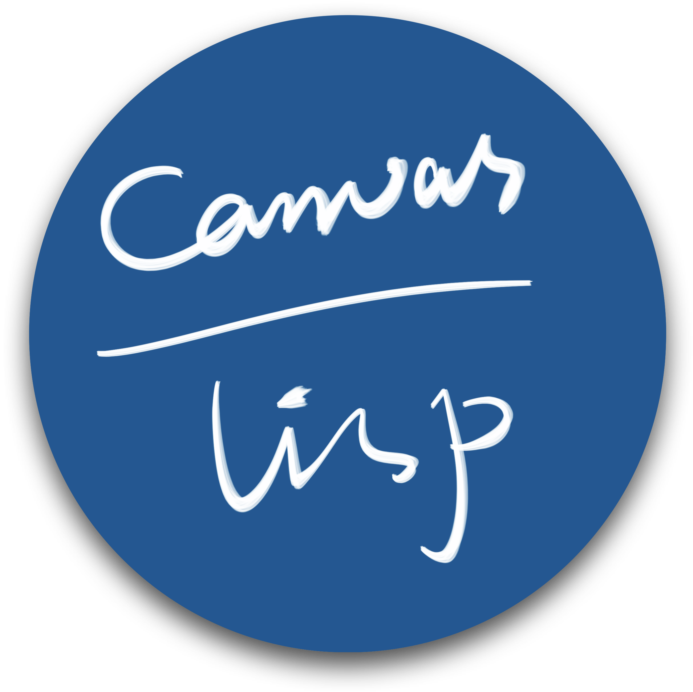

#  Canvas And Lisp Magic

Calm down and draw something, in Lisp.

[](#installation) [](https://github.com/VitoVan/calm/actions/workflows/calm.yml) [](https://github.com/VitoVan/calm/releases/latest)

## Hello World

Find whatever directory, create a file: **canvas.lisp**

```lisp
(in-package #:calm)
(defparameter *color-list* '((0.83 0.82 0.84) (0.89 0.12 0.17) (0.94 0.87 0.47) (0 0.35 0.59)))
(defun draw ()
  (dotimes (i 7)
    (apply #'c:set-source-rgb (nth (if (>= i 4) (- i 4) i) *color-list*))
    (c:arc (+ 60 (* (- (/ *calm-window-width* 5) 40) i)) 70 50 0 (* 2 pi))
    (c:fill-path)))
```

Launch your terminal, cd to that directory, enter the command:

```bash
calm
```

[](#hello-world)

## More Examples

<p align="center">
    <a title="Check the code for Fan" href="./examples/fan"></a>
    <a title="Check the code for Mondrian" href="./examples/mondrian"></a>
    <a title="Check the code for Meditator" href="./examples/meditator"></a>
</p>

Click the image to read more, [click here](https://github.com/VitoVan/calm/releases/latest/download/examples.zip) to download the example pack.

Or check this list for the shiny stuff [Made with CALM](https://github.com/VitoVan/made-with-calm).

## Installation

### Pre-built Binary

1. **Download the [latest release](https://github.com/VitoVan/calm/releases/latest)** for your platform
2. Extract the content
3. Add the extracted folder into your PATH environment

    for macOS, add `/path/to/Calm.app/Contents/MacOS/` instead

### Build Your Own

All the binaries are built with [Github Action](.github/workflows/calm.yml), so the supported environments are limited.

If you are using something not supported (Apple M1 or ARM Windows / Linux), please consider building your own CALM.

You may need to [build your own SBCL](.github/workflows/sbcl.yml) and modify the [sbcl.sh](sh/fedora/sbcl.sh) before executing the following command.

```bash
git clone https://github.com/VitoVan/calm.git
cd calm
# on macOS or Linux
sh build/build.sh
# on Windows (you should have MSVC compiler installed)
build\\build.bat
```


##  Distribution

Distribute your CALM Application.

### Generate Application

Launch your terminal, cd to the directory where the file **canvas.lisp** exists, enter the command:

```bash
calm dist
```

You will get a directory `dist` containing all the dependencies and your final binary, you should put all your assets (.wav, .png, .mp3, etc.) into that directory.

Now, pack it and send it to your friend! Normally, they will be able to enjoy your application. If not, tell them to run the file `calm` or double click `calm.exe`.

There exists a similar command `calm dist-with-canvas`, this one will include `canvas.lisp` in the final `dist` directory. This gives the end user the ability to modify your application.

> **Note**
>
> for macOS, you may want to create an [application bundle](https://en.wikipedia.org/wiki/Bundle_(macOS)) to avoid too many [warning messages](https://support.apple.com/HT202491) for the dylibs:
>
> <details><summary>Click to show code</summary>
> <p>
>
> ```bash
> export APP_ICON=asset/coolapp.icns
> export APP_NAME=Coolapp
> export APP_ID=com.jack.coolapp
> export APP_VERSION=0.0.1
> export DIST_DIR=./dist
> calm sh darwin bundle
> ```
>
> </p>
> </details>

### Generate Package

Instead of sending out the directory, you can also generate pretty packages.

**Linux AppImage**


<details><summary>Click to show code</summary>
<p>

```bash
export DIST_DIR=./dist
export APP_NAME=Coolapp
export APP_ICON="asset/coolapp.png"
calm sh fedora appimage
```

</p>
</details>

**macOS Application Bundle**


<details><summary>Click to show code</summary>
<p>

```bash
# you should have ran `calm sh darwin bundle`
export APP_NAME=Coolapp
export DMG_NAME=coolapp
export DMG_ICON=asset/coolapp-dmg.icns
calm sh darwin dmg
```

</p>
</details>

**Windows Installer**


<details><summary>Click to show code</summary>
<p>

```bash
export DIST_DIR=./dist
export APP_NAME=Coolapp
calm sh msys installer
```

</p>
</details>

### Expedient Distribution

Your friend is using Linux / macOS / Windows, but you don't have the corresponding OS.

Let's say it's Windows.

You could also distribute expediently:

1. download [the latest](https://github.com/VitoVan/calm/releases/latest) `hello-canvas.zip `
2. extract it
3. replace the `canvas.lisp` file with yours
4. zip it and send it to your friend

> **Note**
> 1. Don't use Quicklisp, normally it won't work.
> 2. CFFI might work, but foreign libraries (except SDL2, Cairo, etc.) are not guaranteed to exist.

## Environment Variables

Setf-able:

- `SDL_VIDEO_ALLOW_SCREENSAVER=1`

  Allow screensaver, check [Why does SDL disable my screensaver by default?](https://wiki.libsdl.org/SDL2/FAQUsingSDL#why_does_sdl_disable_my_screensaver_by_default).

  You can use `(setf (uiop:getenv "SDL_VIDEO_ALLOW_SCREENSAVER") "1")` to set it.

Read-only:

- `CALM_DIR`

  This variable holds the path of the directory where calm binary exists

- `APP_DIR`

  This variable holds the path of the directory where calm was started up (aka `pwd`)

## Tutorials

Not yet, but here are some links might be helpful:

- SDL2
    - https://wiki.libsdl.org/SDL2
    - https://github.com/lispgames/cl-sdl2

- Cairo
  - https://www.cairographics.org/
  - https://github.com/rpav/cl-cairo2
    in `(c:fill-path)`, the `c` is a nickname for `cl-cairo2`

- CALM
  - https://github.com/VitoVan/calm/blob/main/src/config.lisp
  - https://github.com/VitoVan/calm/blob/main/src/utils.lisp

- Development Tools
    - https://slime.common-lisp.dev/
    - https://lispcookbook.github.io/cl-cookbook/vscode-alive.html

- Common Lisp
  - https://lispcookbook.github.io/cl-cookbook/
  - http://www.lispworks.com/documentation/HyperSpec/Front/
  - https://lisp-lang.org/books/
