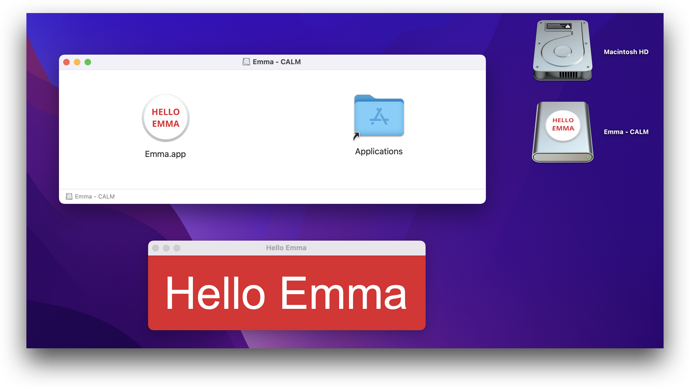

# Getting Started

Now we have [installed CALM](installation.md).

The next thing is to find a good place and create the file: **canvas.lisp**:

```lisp
(in-package #:calm)

(setf *calm-window-width* 600)
(setf *calm-window-height* 150)

(setf *calm-window-title* "CALM")

(defun draw ()

  ;; paint the background

  (c:set-source-rgb (/ 12 255) (/ 55 255) (/ 132 255))
  (c:paint)

  ;; show the text

  (c:move-to 30 100)
  (c:set-source-rgb 1 1 1)
  (c:set-font-size 84)
  (c:show-text "DON'T PANIC"))
```

The code is self-explaining, but some of them may seem a little confusing, we will cover them later.

Let's just put it into a directory named: `hello`.

Now the directory looks like this:

```bash
hello/
└── canvas.lisp

1 directory, 1 file
```

Change some of the content inside **canvas.lisp**, then execute `calm` inside the directory `hello`:

```bash
cd hello
calm
```


You will see the changes you made.

Modify **canvas.lisp**, restart `calm`; and modify **canvas.lisp** again, then restart `calm` again.

Play with it until you get bored, and then move on to the next section.

## Share It With Emma

Let's say it's Jack.

Jack have a good friend Emma, and he changed the **canvas.lisp** into this:

```lisp
(in-package #:calm)

(setf *calm-window-width* 520)
(setf *calm-window-height* 140)

(setf *calm-window-title* "Hello Emma")

(defun draw ()
  ;; paint the background to Emma's favorite color
  (c:set-source-rgb 0.89 0.12 0.17)
  (c:paint)
  ;; show Hello Emma
  (c:move-to 30 100)
  (c:set-source-rgb 1 1 1)
  (c:set-font-size 84)
  (c:show-text "Hello Emma"))
```


Even though this seems quite dumb, Jack decided to send this to Emma.

Emma uses the same macOS as Jack and knows nothing about Lisp or Terminal.

So Jack generated a fancy DMG with the following command:

```bash
calm publish
```

and sent it to Emma.



When Emma downloaded the DMG and opened the application, she smiled.

Your Emma is using Windows or Linux? Don't worry, check this: [Share & Publish](share-and-publish.md#publish).
