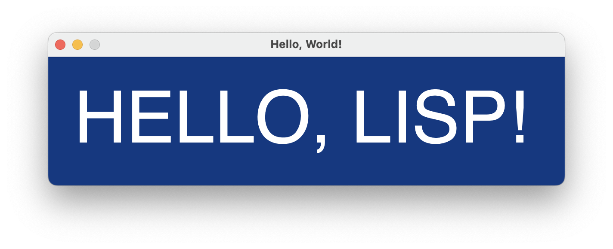

# Getting Started

Let's download a CALM sample application and modify it.

## Hello, World!

Download the CALM sample application for your platform:

| Platform | Specifics     | CPU    | Download                                                     |
| -------- | ---------------- | ------ | ------------------------------------------------------------ |
| 🐧 Linux    | glibc >= 2.35    | x86_64 | [hello-canvas.tgz](https://github.com/VitoVan/calm/releases/download/0.0.33/hello-canvas.tgz) |
| 🍏 macOS    | Monterey   | x86_64 | [hello-canvas.dmg](https://github.com/VitoVan/calm/releases/download/0.0.33/hello-canvas.dmg) |
| 🏁 Windows  | 10 or 11 | x86_64 | [hello-canvas.zip](https://github.com/VitoVan/calm/releases/download/0.0.33/hello-canvas.zip) |
| macOS    | Big Sur   | x86_64 | [hello-canvas-macos-11.dmg](https://github.com/VitoVan/calm/releases/download/0.0.33/hello-canvas-macos-11.dmg) |
| macOS    | Catalina   | x86_64 | [hello-canvas-macos-10.15.dmg](https://github.com/VitoVan/calm/releases/download/0.0.33/hello-canvas-macos-10.15.dmg) |

If your Platform or CPU are not listed, then you might have to check the [installation](installation.md#run-calm-from-source) page to see how to run CALM from source. Otherwise, just downloaded the sample application and run it!


### Run the Sample Application

If the "DON'T PANIC" window has already shown on your screen, feel safe to skip this section.

> On macOS, please drag the application out of the mounted DMG directory, we are going to modify it later (it's read-only if it stayed there).

When running applications, there are some differences between Linux, macOS and Windows.

- Linux
  ```bash
  tar xvf hello-canvas.tgz
  cd hello-canvas
  ./calm
  ```
- macOS
  1. Open the downloaded DMG file
  2. Drage the .app out (to be able to modify it)

        to the Desktop, Downloads or Applications folder if you like
  3. Eject the DMG and run the application
     > On macOS, it's very likely the system will stop you from running the software, since it's not verified by Apple. If you have problem to run it, please check [this](https://support.apple.com/HT202491).

- Windows
  1. Right click to Extract All
  2. Open the extracted folder, double click `calm.exe`

If you have finished the above steps, the "DON'T PANIC" window should have shown.

### Modify the Sample Application

Now open the file `canvas.lisp`:

1. search for `(setf *calm-window-title* "CALM")`

   change it to `(setf *calm-window-title* "Hello, World!")`
   
2. search for `(c:show-text "DON'T PANIC")`

    change it to `(c:show-text "HELLO, LISP!")`

3. save the file and restart the application.



Congrats! You have built your first CALM application!

Can't wait to build something? Please check those [tutorials](tutorials.md)!


