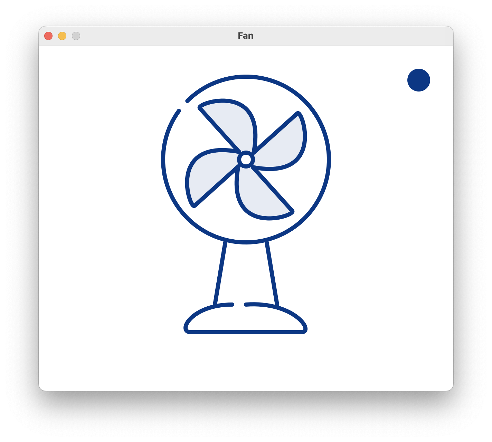
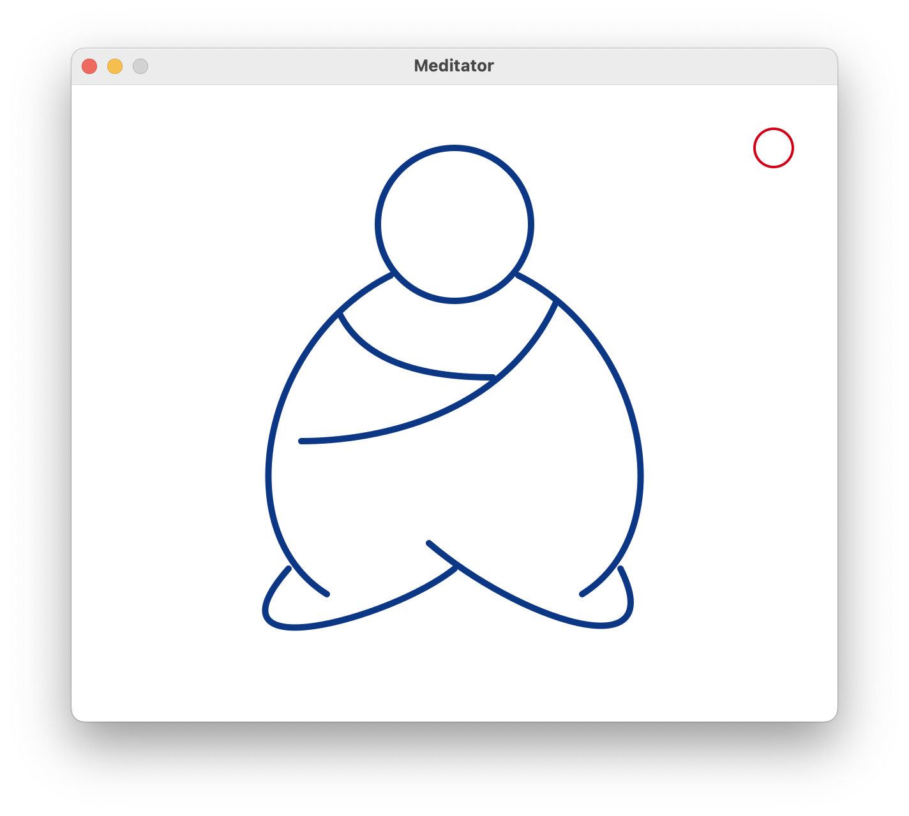
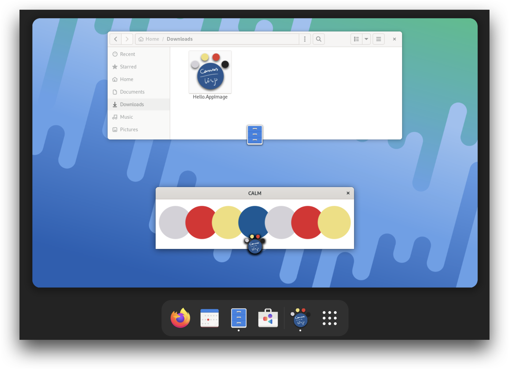

# Introduction

[CALM](https://github.com/VitoVan/calm) (Canvas And Lisp Magic) is a Lisp development kit with the following features:

- cross-platform support (Linux / macOS / Windows)
- easy to write small GUI apps / games or generative arts
- easy to pack AppImage / macOS Application Bundle / Windows Installer
- NOT advising you to use Emacs

With CALM, we can finally:

> Calm down and draw something, in Lisp.

Here are some applications made with CALM:

For more examples, you can find them [here](https://github.com/VitoVan/made-with-calm).

## What Else?

CALM bundled SBCL, Quicklisp, SDL2, Cairo Graphics and some other libraries.

So we can distribute applications without worrying about dependencies, they are well handled.

Our non-wizard users could run our application peacefully.

For the screenshots of macOS DMG and Windows Installer, you can find them [here](https://github.com/VitoVan/calm/#generate-package).

## Does It Suit Me?

If you are one of those good old wizards, then there is nothing new here, please feel free to poke around the messy code, and give me some advices if you like.

If you are new to Lisp, then congrats!

With CALM, you can learn Lisp in a way with much more fun. Since you can build colorful GUI applications and share them with your friends along the learning journey!

So, shall we?

The first step should be: [Getting Started](getting-started.md).
