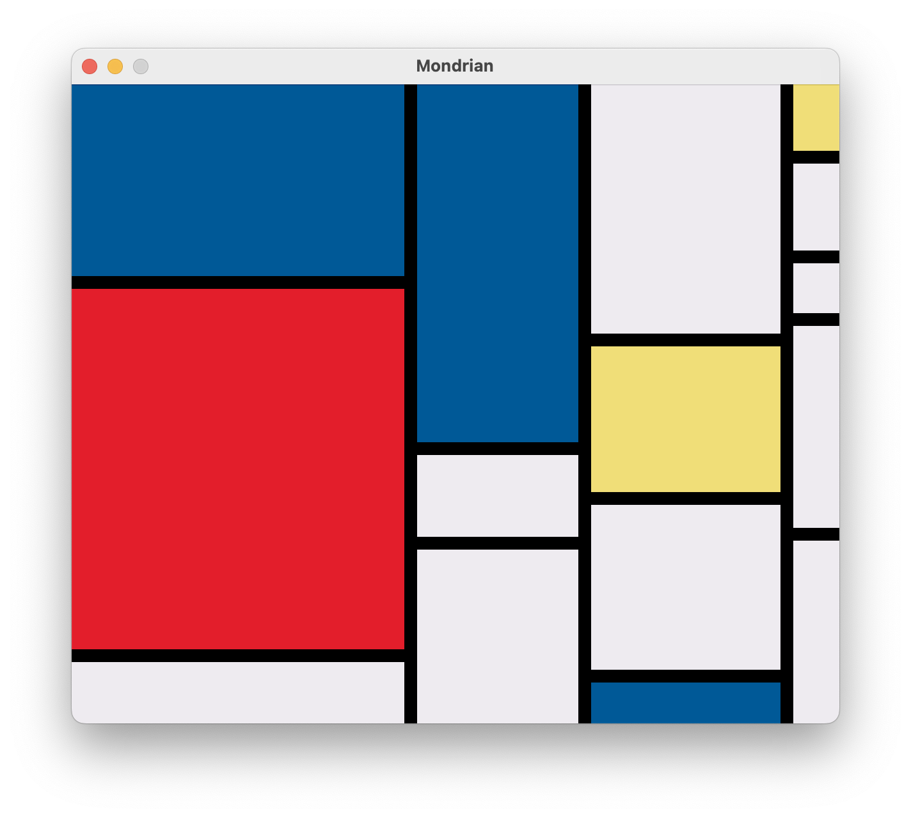

# Introduction


[CALM](https://github.com/VitoVan/calm) is short for **C**anvas **A**nd **L**isp **M**agic.

It is a Lisp development kit with the following features:

- Cross-platform Support

   Linux, macOS, and Windows

- Canvas Oriented

  Suitable for creating generative arts, games, or small GUI apps

- End-user Friendly

  Produce Linux AppImage, macOS Application Bundle or Windows Installer

- Battery Charged and Included

  Useful dependencies well handled: SBCL, Quicklisp, SDL2, etc

With CALM, we can finally:

> CALM down and draw something, in Lisp.

<a href="https://github.com/VitoVan/calm/tree/main/docs/src/examples/fan"></a>
<a href="https://github.com/VitoVan/calm/tree/main/docs/src/examples/mondrian/"></a>
<a href="https://github.com/VitoVan/calm/tree/main/docs/src/examples/meditator/"></a>

For more examples, you can find them [here](https://github.com/VitoVan/made-with-calm).

## What's It Like?

Find whatever directory, create a file: **canvas.lisp**

```lisp
(in-package #:calm)
(defparameter *color-list* '((0.83 0.82 0.84) (0.89 0.12 0.17) (0.94 0.87 0.47) (0 0.35 0.59)))
(defun draw ()
  (dotimes (i 7)
    (apply #'c:set-source-rgb (nth (if (>= i 4) (- i 4) i) *color-list*))
    (c:arc (+ 60 (* (- (/ *calm-window-width* 5) 40) i)) 70 50 0 (* 2 pi))
    (c:fill-path)))
```

Launch your terminal, cd to that directory, enter the command:

```bash
calm
```


## Give It a Try?

If you are interested, please check this [Installation Guide](installation.md).
