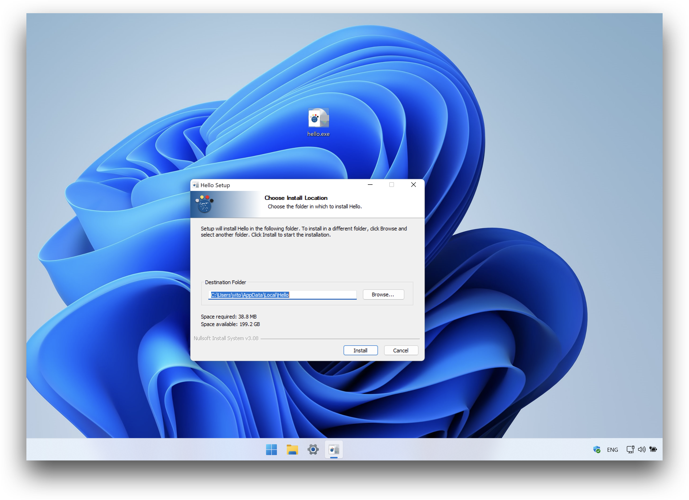

# Share & Publish

CALM has 2 built-in commands for sharing and publishing your applications.

## Share


To share your work with someone who has [CALM installed](installation.md).

Change to the directory contains **canvas.lisp**, execute:

```bash
calm share
```

This command will compress the following files and directories:

- ./canvas.lisp
- ./src/
- ./assets/

into 1 zip file **calm-share.calm**

Send your `calm-share.calm` to your firends, they could just double click this file to run.

Or use the following command:

```bash
calm calm-share.calm
```

## Publish


To publish your work to non-wizard users who have no idea what the Terminal is.

Change to the directory contains **canvas.lisp**, execute:

```bash
calm publish
```

On different platforms, this command will have different effects.

- Linux

  Some questions will be asked, then an AppImage will be generated.

  Linux user knows how to run this file, if not, refer to this link: [How to run an AppImage](https://docs.appimage.org/introduction/quickstart.html#how-to-run-an-appimage)

  


- macOS

  Some questions will be asked, a DMG file will be generated.

  macOS user will open this DMG and can't resist dragging it into Applications directory.
  

- Windows

  Some questions will be asked, an installer file will be generated.

  Windows user will install and run it as any other regular applications.

  

  There will be shortcuts on the Desktop and the Start Menu.

  An uninstaller will also be found from the Start Menu and the Control Panel.
